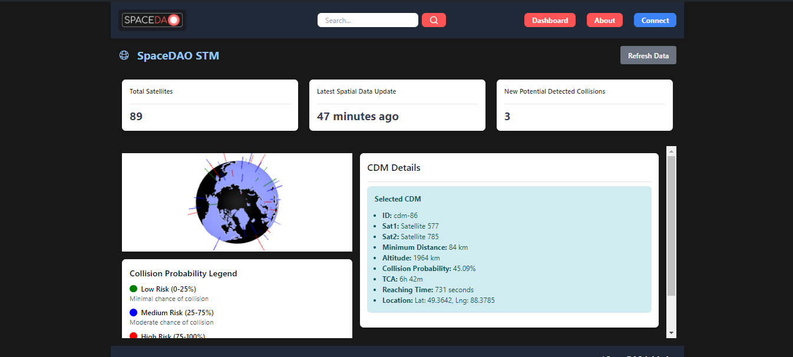
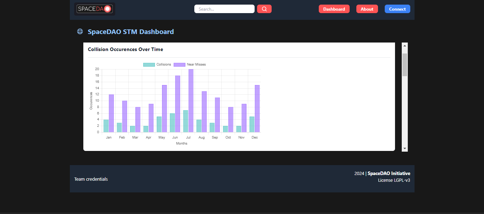
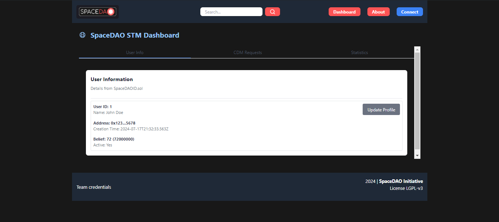
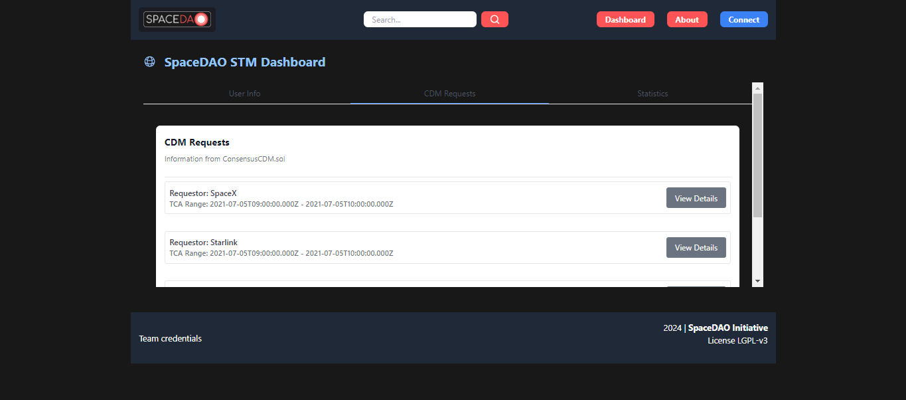
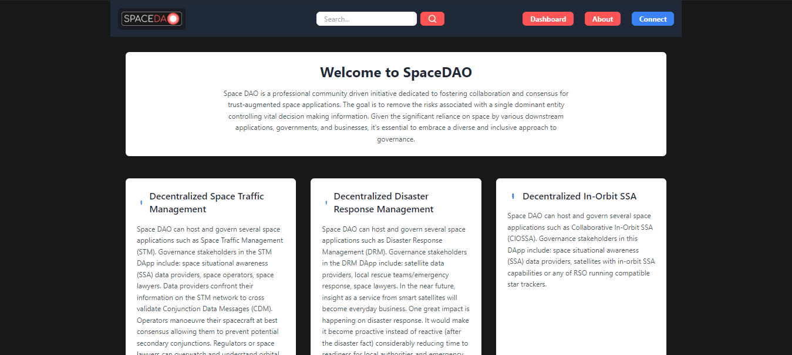

# Space Traffic Web3 UI | Google Summer Of Code 2024


[Explore the docs »](https://gitlab.com/spacedao/frontend/spacedao-global-ui/-/tree/antoine?ref_type=heads)
· [View Demo](https://spacedao.ai/) · [Report Bug](https://gitlab.com/spacedao/frontend/spacedao-global-ui/-/issues) · [Request Feature](https://gitlab.com/spacedao/frontend/spacedao-global-ui/-/issues)

## Table Of Contents

- [About project](#-about-the-project)
- [Folder Structure](#folder-structure)
- [Key features](#key-features)
- [Built with](#built-with)
- [Getting started](#-getting-started)
- [Prerequisities](#-prerequisities)
- [Installation](#installation)
- [Usage](#-usage)
- [Other infos for Developers](#other-info-for-developers)
- [Contributing](#-contributing)
- [Licensing](#-licensing)
- [Contact](#-contact)

## 🚀 About The Project

SpaceDAO STM (Space Traffic Management) is a groundbreaking decentralized application revolutionizing space traffic monitoring and management. This repository houses the frontend implementation, serving as the user interface for this innovative blockchain-based solution.



## Folder Structure

- **src/** : Contains the application's source code.
- **components/** : Reusable components of the application.
- **assets/** : Static resources such as images, icons, etc.
- **App.vue** : Main file of the application.
- **main.ts** : Entry point of the application.
- **public/** : Contains static files accessible to the public.
- **package.json** : npm configuration file.
- **README.md** : This file.

## Key Features

- 🌐 Interactive 3D globe visualization of satellite positions and trajectories
- 🚨 Real-time collision risk assessment and alerting system
- 🤝 Intuitive interface for consensus-based decision making on space maneuvers
- 📊 Data-rich dashboards for comprehensive space situational awareness
- 🔗 Seamless Web3 wallet integration for blockchain interactions

## Built With

- **[Vue.js version 3](https://vuejs.org/)**: For building a reactive and component-based UI
- **[TypeScript](https://www.typescriptlang.org/)**: Ensuring type safety and improved developer experience
- **[Pinia](https://pinia.vuejs.org/)**: For efficient state management
- **[Tailwind CSS](https://tailwindcss.com/)**: For rapid, utility-first styling
- **[Vite](https://vitejs.dev/)**: As a next-generation frontend build tool
- **[Three.js](https://threejs.org/)**: Powering 3D visualizations of space objects
- **[Globe.gl](https://globe.gl/)**: 3D visualization of terrestrial globe
- **[Chart.js](https://www.chartjs.org/)**: For data visualization and analytics

## 🛠 Getting Started

Follow these steps to set up the project locally.

## Prerequisities

- Node.js (v14.x or later)
- npm (v6.0.0 or later)
- MetaMask or similar Web3 wallet

## Installation

1. Clone the repository

   ```sh
   git clone https://gitlab.com/spacedao/frontend/spacedao-global-ui.git
   cd spacedao-global-ui
   ```

2. Install dependencies

   ```sh
   npm install
   ```

3. Set up environment variables

```sh
 cp .env.example .env
 # Edit .env with your specific configuration
```

4. Start the development server

   ```sh
   npm run dev
   ```

5. Open `http://localhost:5173/` in your browser

## 🖥 Usage

Here's a quick overview of how to use key features of the SpaceDAO STM frontend:

1. **Explore Space Data**: Navigate the 3D globe to view satellite positions and trajectories.


2. **Monitor Collision Risks**: Check the dashboard for real-time collision risk assessments.



3. **Manage your spatial user profile**: Check the user dashboard tab to manage your spatial user profile.



4. **Participate in Consensus**: Vote on proposed space maneuvers when prompted.
   

For more detailed usage instructions, please refer to our User Guide.


## Other info for developers

### Run Unit Tests with [Vitest](https://vitest.dev/)

```sh
npm run test:unit
```

## 🤝 Contributing

Contributions are what make the open-source community an amazing place to learn, inspire, and create. Any contributions you make are **greatly appreciated**.

1. Fork the Project
2. Create your Feature Branch

```sh
git checkout -b feature/AmazingFeature
```

3. Commit your Changes

```sh
git commit -m 'Add some AmazingFeature'
```

4. Push to the Branch

```sh
git push origin feature/AmazingFeature
```

5. Open a Merge Request

Don't forget to give the project a star! Thanks again!

## 📜 Licensing

This work is licensed under the GNU LESSER GENERAL PUBLIC LICENSE
version 3 and above. All contributors accepts terms of this license.
See `LICENSE` for more information.

## 📞 Contact

- SpaceDAO Team - [@SpaceDAO](https://www.linkedin.com/company/space-dao-ai/)
- Project Link: https://gitlab.com/spacedao/frontend/spacedao-global-ui/-/tree/antoine?ref_type=heads
